# OpenClaw 与小智 AI 融合创新：ClawLink-Lorry 全链路开源方案

# 一、两个项目完整开源信息资料汇总

## 1. OpenClaw 开源核心信息

|项目维度|详细开源资料|
|---|---|
|官方主仓库|[https://github.com/openclaw/openclaw](https://github.com/openclaw/openclaw) （MIT 开源协议）|
|官方文档|中文文档：[https://openclaws.io/zh/faq](https://openclaws.io/zh/faq) ；英文文档：[https://github.com/openclaw/openclaw/blob/main/docs/index.md](https://github.com/openclaw/openclaw/blob/main/docs/index.md)|
|核心定位|开源自托管的**个人AI智能体网关**，运行于PC/服务器（Windows/macOS/Linux），定位「24小时个人数字员工」，实现「对话→规划→执行→反馈」全闭环|
|核心能力|1. 多平台统一接入：支持WhatsApp/Telegram/飞书/Slack/Discord等13+主流IM工具，无需额外APP <br>2. 模型无关：支持Claude/GPT/Gemini，以及Ollama接入本地开源模型（Llama/Phi等） <br>3. 通用执行能力：系统级文件操作、命令行执行、浏览器自动化、邮件管理、任务调度 <br>4. 插件生态：AgentSkills 扩展系统，100+预置技能，500+社区插件 <br>5. 多智能体路由：支持多工作区、隔离会话，可区分个人/工作场景|
|部署要求|Node.js 22+，支持x86/ARM架构PC/服务器，Windows需WSL2，一键安装命令：`npm install -g openclaw@latest`|
|核心架构|「Gateway网关」为核心控制中枢，统一管理通讯渠道、AI代理、工具调用，采用「消息接入→LLM推理→工具执行→结果回传」的标准Agent流程|
## 2. 小智AI 开源核心信息

|项目维度|详细开源资料|
|---|---|
|官方主仓库|固件端：[https://github.com/SmallPond/xiaozhi-esp32](https://github.com/SmallPond/xiaozhi-esp32) ；服务端：[https://github.com/78/xiaozhi-esp32-server](https://github.com/78/xiaozhi-esp32-server) （MIT 开源协议）|
|官方文档|中文文档中心：[https://xiaozhi.dev/docs/](https://xiaozhi.dev/docs/) ；开发指南：[https://xiaozhi.dev/docs/development/](https://xiaozhi.dev/docs/development/)|
|核心定位|开源嵌入式**端侧语音交互系统**，原生运行于ESP32系列芯片，定位「语音控制万物的物联网入口」，降低AI硬件开发门槛|
|核心能力|1. 端侧语音优化：离线语音唤醒（<200ms响应，支持26+唤醒词）、流式ASR/TTS、5种语言识别（中/英/粤/日/韩）、声纹识别 <br>2. ESP32深度适配：原生支持ESP32-S3/C3/P4，直接驱动GPIO/I2C/PWM外设，兼容70+开源硬件方案 <br>3. 端云协同架构：端侧负责音频采集/硬件控制，云端负责LLM/ASR/TTS，支持MCP/MQTT协议设备控制 <br>4. 多模型支持：对接DeepSeek/Qwen/豆包/GPT等主流大模型，支持自定义提示词与角色设定 <br>5. 低门槛部署：提供开箱即用的一键烧录固件，零代码即可完成部署，配套完整的新手教程|
|部署要求|硬件：ESP32-S3-WROOM-1-N8R2及以上（推荐16MB Flash+8MB PSRAM）、INMP441麦克风、MAX98357A功放<br>开发环境：ESP-IDF v5.1+，支持Windows/macOS/Linux|
|核心架构|「端侧固件+中转服务端」架构，端侧负责音频处理、硬件驱动、网络连接，服务端负责语音与大模型能力转发，通过WebSocket/MQTT实现双向通信|
---

# 二、融合创新项目方案（开发者：lorry）

## 项目核心信息

- **项目名称**：**ClawLink-Lorry**

- **开源协议**：MIT License（兼容两个上游项目）

- **核心定位**：全球首个深度融合OpenClaw与小智AI的全链路开源AI硬件智能体系统，实现「**语音/多平台文字双入口→LLM复杂任务规划→端侧硬件执行→结果双向同步→全自动化闭环**」，彻底打通上位机通用AI执行能力与端侧语音硬件控制能力。

- **核心创新优势**：

    1. 双入口全闭环：既支持ESP32端侧离线语音交互，也支持OpenClaw全平台IM工具文字指令，结果双向同步

    2. 优势互补：复用OpenClaw的多平台接入、复杂任务规划、通用工具执行能力，解决小智AI通用能力弱、多平台接入不足的问题；复用小智AI的端侧语音优化、ESP32原生硬件驱动能力，解决OpenClaw无原生端侧交互、硬件控制依赖额外对接的问题

    3. 完全兼容生态：100%兼容OpenClaw的AgentSkills插件与小智AI的硬件适配方案，社区资源可无缝迁移

    4. 离线兜底能力：断网时ESP32端侧可本地执行基础硬件控制指令，不依赖上位机，可用性拉满

    5. 完全开源可扩展：模块化架构，支持新增传感器、执行器、第三方平台、自定义技能，适配你的ESPclaw-lorry原有硬件方案

---

## 三、系统整体架构（全闭环设计）

```mermaid
flowchart LR
    A[交互入口层] --> B[智能体核心层]
    B --> C[通信网关层]
    C --> D[端侧执行层]
    D --> C
    C --> B
    B --> A

    subgraph A[交互入口层]
        A1[语音入口<br>ESP32端侧<br>小智AI离线唤醒/ASR/TTS]
        A2[文字入口<br>OpenClaw支持的全平台<br>WhatsApp/飞书/Telegram等]
    end

    subgraph B[智能体核心层<br>基于OpenClaw改造]
        B1[统一消息调度<br>语音/文字指令标准化]
        B2[LLM任务规划<br>复杂任务拆解/步骤规划]
        B3[AgentSkills插件系统<br>硬件控制/工具调用/状态同步]
        B4[执行状态管理<br>异常处理/结果同步/记忆存储]
    end

    subgraph C[通信网关层<br>MQTT 3.1.1]
        C1[MQTT Broker<br>EMQX/本地Mosquitto]
        C2[双向通信<br>指令下发/状态上报/数据回传]
        C3[安全认证<br>TLS加密/设备鉴权]
    end

    subgraph D[端侧执行层<br>基于小智AI固件改造]
        D1[语音交互核心<br>小智AI唤醒/ASR/TTS]
        D2[MQTT客户端<br>与上位机双向通信]
        D3[硬件驱动层<br>舵机/传感器/外设控制<br>兼容ESPclaw-lorry原有方案]
        D4[离线执行兜底<br>断网本地指令执行]
    end
```


### 全自动化闭环核心流程示例

用户指令：「你好ClawLink，打开机械爪，采集温湿度，把结果发到我的飞书群，同时语音播报给我」

1. **入口触发**：ESP32端侧离线唤醒，采集语音并通过ASR转为文字指令

2. **指令上报**：端侧通过MQTT将指令上报给上位机OpenClaw

3. **任务规划**：OpenClaw的LLM拆解任务为4步：① 打开机械爪 ② 采集温湿度 ③ 结果同步到飞书 ④ 端侧语音播报结果

4. **硬件执行**：OpenClaw通过MQTT下发「打开机械爪」指令，ESP32端侧执行舵机控制，完成后上报执行状态

5. **数据采集**：OpenClaw下发「采集温湿度」指令，ESP32端侧采集传感器数据，上报给上位机

6. **多平台同步**：OpenClaw调用飞书Skill插件，将温湿度数据与执行结果发送到指定飞书群

7. **结果反馈**：OpenClaw通过MQTT将最终结果下发给ESP32，端侧通过TTS语音播报给用户

8. **闭环完成**：整个流程无需人工干预，实现「指令→规划→执行→反馈→同步」全自动化

---

# 四、完整落地部署方案（分6步，可直接执行）

## 前置环境准备

|设备/软件|要求规格|
|---|---|
|上位机|Windows/macOS/Linux 系统，Node.js 22+，Python 3.10+，稳定网络|
|硬件设备|ESP32-S3-WROOM-1-N16R8开发板、INMP441麦克风、MAX98357A功放、MG90S舵机×4、AHT20温湿度传感器、杜邦线、5V/2A电源|
|开发工具|VS Code、ESP-IDF v5.1+、Git、MQTT Broker（EMQX本地部署或公共服务）|
---

## 步骤1：MQTT通信网关部署（核心链路）

MQTT是打通上位机与端侧的核心，推荐使用EMQX本地部署，也可使用公共MQTT服务测试。

### 本地部署EMQX（Docker一键部署）

```Bash

# 拉取EMQX镜像
docker pull emqx/emqx:latest
# 启动EMQX服务，1883端口为MQTT默认端口，18083为后台管理端口
docker run -d --name emqx-clawlink -p 1883:1883 -p 18083:18083 emqx/emqx:latest
```

### 配置说明

- 访问后台：[http://localhost:18083](http://localhost:18083) ，默认账号admin，默认密码public

- 创建设备认证：新建用户名`clawlink-lorry`，密码`你的自定义密码`，用于上位机与端侧的鉴权

- 核心Topic定义：

    - 指令下发Topic：`clawlink/lorry/esp32/cmd`

    - 状态上报Topic：`clawlink/lorry/esp32/report`

    - 语音指令上报Topic：`clawlink/lorry/esp32/voice_cmd`

---

## 步骤2：上位机OpenClaw改造与部署

### 2.1 基础OpenClaw安装

```Bash

# 全局安装OpenClaw
npm install -g openclaw@latest
# 初始化配置，按照向导完成Wi-Fi、LLM API、IM平台接入
openclaw onboard
# 启动OpenClaw网关后台服务
openclaw start --daemon
```

### 2.2 核心改造：新增ClawLink自定义Skill插件

OpenClaw通过AgentSkills扩展能力，我们新增自定义插件，实现MQTT通信、硬件控制、指令同步能力。

#### 插件文件路径：`~/.openclaw/skills/clawlink-lorry.skill.md`

```Markdown

# ClawLink-Lorry 硬件控制Skill
## 描述
对接ClawLink-Lorry项目的ESP32端侧设备，实现MQTT指令下发、状态上报、硬件控制、传感器数据采集，是OpenClaw与小智AI融合的核心插件。
## 版本
1.0.0
## 作者
lorry
## 权限
network
## 依赖
mqtt
```

```JavaScript

// 安装依赖：npm install mqtt
const mqtt = require('mqtt');

// MQTT配置（修改为你的EMQX地址和认证信息）
const MQTT_BROKER = 'mqtt://你的上位机IP:1883';
const MQTT_USERNAME = 'clawlink-lorry';
const MQTT_PASSWORD = '你的自定义密码';
const TOPIC_CMD = 'clawlink/lorry/esp32/cmd';
const TOPIC_REPORT = 'clawlink/lorry/esp32/report';

// 初始化MQTT客户端
let client = mqtt.connect(MQTT_BROKER, {
    username: MQTT_USERNAME,
    password: MQTT_PASSWORD,
    clientId: 'openclaw-lorry-' + Math.random().toString(16).substr(2, 8)
});

// 连接成功回调
client.on('connect', () => {
    console.log('ClawLink MQTT连接成功');
    client.subscribe(TOPIC_REPORT);
});

// 接收端侧上报数据
let latestReport = {};
client.on('message', (topic, message) => {
    if (topic === TOPIC_REPORT) {
        latestReport = JSON.parse(message.toString());
        console.log('收到ESP32端侧上报：', latestReport);
    }
});

// 核心技能函数：发送指令到ESP32端侧
async function sendHardwareCommand(action, params = {}) {
    if (!client.connected) {
        throw new Error('MQTT客户端未连接');
    }
    const cmd = JSON.stringify({ action, params, timestamp: Date.now() });
    client.publish(TOPIC_CMD, cmd);
    // 等待端侧响应，超时3秒
    return new Promise((resolve) => {
        const timeout = setTimeout(() => {
            resolve({ success: false, msg: '指令发送成功，等待端侧响应超时' });
        }, 3000);
        const checkReport = setInterval(() => {
            if (latestReport.timestamp && latestReport.timestamp > Date.now() - 3000) {
                clearTimeout(timeout);
                clearInterval(checkReport);
                resolve({ success: true, data: latestReport });
            }
        }, 200);
    });
}

// 技能函数：舵机控制
async function controlServo(id, angle) {
    return await sendHardwareCommand('control_servo', { id, angle });
}

// 技能函数：传感器数据采集
async function getSensorData(type) {
    return await sendHardwareCommand('get_sensor', { type });
}

// 技能函数：端侧语音播报
async function speak(text) {
    return await sendHardwareCommand('speak', { text });
}

// 技能函数：获取设备状态
async function getDeviceStatus() {
    return await sendHardwareCommand('get_status');
}
```

### 2.3 配置语音指令同步

修改OpenClaw的消息路由配置，新增对`clawlink/lorry/esp32/voice_cmd` Topic的监听，将ESP32端侧上报的语音指令，自动接入OpenClaw的LLM任务规划流程，实现语音指令的全闭环处理。

---

## 步骤3：端侧ESP32固件改造与编译（基于小智AI）

基于小智AI官方固件，改造整合MQTT客户端、ClawLink指令解析、你的ESPclaw-lorry原有舵机/传感器驱动，实现与上位机的双向通信。

### 3.1 拉取小智AI官方固件源码

```Bash

# 克隆小智AI固件仓库
git clone https://github.com/SmallPond/xiaozhi-esp32.git
cd xiaozhi-esp32
# 切换到稳定版本
git checkout v2.1.0
```

### 3.2 核心改造文件1：新增MQTT客户端模块

新建文件 `main/clawlink_mqtt.h`

```C

#ifndef CLAWLINK_MQTT_H
#define CLAWLINK_MQTT_H

#include "mqtt_client.h"
#include "esp_err.h"

// MQTT配置（修改为你的EMQX地址和认证信息）
#define MQTT_BROKER_URI "mqtt://你的上位机IP:1883"
#define MQTT_USERNAME "clawlink-lorry"
#define MQTT_PASSWORD "你的自定义密码"
#define MQTT_CLIENT_ID "clawlink-esp32-lorry"

// Topic定义
#define TOPIC_CMD "clawlink/lorry/esp32/cmd"
#define TOPIC_REPORT "clawlink/lorry/esp32/report"
#define TOPIC_VOICE_CMD "clawlink/lorry/esp32/voice_cmd"

// 初始化ClawLink MQTT客户端
esp_err_t clawlink_mqtt_init(void);

// 上报数据到上位机
esp_err_t clawlink_report_data(const char *data);

// 上报语音指令到上位机
esp_err_t clawlink_report_voice_cmd(const char *cmd);

#endif // CLAWLINK_MQTT_H
```

新建文件 `main/clawlink_mqtt.c`

```C

#include "clawlink_mqtt.h"
#include "esp_log.h"
#include "clawlink_cmd.h"
#include "cJSON.h"

static const char *TAG = "CLAWLINK_MQTT";
static esp_mqtt_client_handle_t mqtt_client = NULL;

// MQTT事件处理
static esp_err_t mqtt_event_handler(esp_mqtt_event_handle_t event)
{
    switch (event->event_id) {
        case MQTT_EVENT_CONNECTED:
            ESP_LOGI(TAG, "MQTT连接成功");
            // 订阅指令下发Topic
            esp_mqtt_client_subscribe(mqtt_client, TOPIC_CMD, 1);
            break;
        case MQTT_EVENT_DISCONNECTED:
            ESP_LOGW(TAG, "MQTT断开连接，尝试重连");
            break;
        case MQTT_EVENT_DATA:
            ESP_LOGI(TAG, "收到上位机指令：%.*s", event->data_len, event->data);
            // 解析并执行指令
            clawlink_parse_cmd(event->data);
            break;
        default:
            break;
    }
    return ESP_OK;
}

// 初始化MQTT客户端
esp_err_t clawlink_mqtt_init(void)
{
    esp_mqtt_client_config_t mqtt_cfg = {
        .uri = MQTT_BROKER_URI,
        .username = MQTT_USERNAME,
        .password = MQTT_PASSWORD,
        .client_id = MQTT_CLIENT_ID,
        .event_handle = mqtt_event_handler,
        .keepalive = 60,
    };

    mqtt_client = esp_mqtt_client_init(&mqtt_cfg);
    return esp_mqtt_client_start(mqtt_client);
}

// 上报数据到上位机
esp_err_t clawlink_report_data(const char *data)
{
    if (mqtt_client == NULL) return ESP_ERR_INVALID_STATE;
    int msg_id = esp_mqtt_client_publish(mqtt_client, TOPIC_REPORT, data, 0, 1, 0);
    ESP_LOGI(TAG, "上报数据成功，msg_id: %d", msg_id);
    return ESP_OK;
}

// 上报语音指令到上位机
esp_err_t clawlink_report_voice_cmd(const char *cmd)
{
    if (mqtt_client == NULL) return ESP_ERR_INVALID_STATE;
    cJSON *root = cJSON_CreateObject();
    cJSON_AddStringToObject(root, "cmd", cmd);
    cJSON_AddNumberToObject(root, "timestamp", esp_timer_get_time() / 1000);
    const char *data = cJSON_Print(root);
    int msg_id = esp_mqtt_client_publish(mqtt_client, TOPIC_VOICE_CMD, data, 0, 1, 0);
    cJSON_Delete(root);
    free((void *)data);
    ESP_LOGI(TAG, "上报语音指令成功，msg_id: %d", msg_id);
    return ESP_OK;
}
```

### 3.3 核心改造文件2：新增指令解析与硬件驱动模块

新建文件 `main/clawlink_cmd.h`

```C

#ifndef CLAWLINK_CMD_H
#define CLAWLINK_CMD_H

#include "esp_err.h"

// 解析并执行上位机下发的指令
void clawlink_parse_cmd(const char *cmd_json);

// 舵机控制函数
esp_err_t clawlink_servo_set(int id, int angle);

// 传感器数据采集函数
void clawlink_sensor_get(const char *type, char *result_buf, int buf_len);

#endif // CLAWLINK_CMD_H
```

新建文件 `main/clawlink_cmd.c`（整合你之前的ESPclaw-lorry舵机/传感器驱动）

```C

#include "clawlink_cmd.h"
#include "servo.h"
#include "sensors.h"
#include "esp_log.h"
#include "cJSON.h"
#include "clawlink_mqtt.h"
#include "audio_player.h"

static const char *TAG = "CLAWLINK_CMD";

// 舵机控制实现
esp_err_t clawlink_servo_set(int id, int angle) {
    // 兼容你的ESPclaw-lorry 4路舵机驱动
    return servo_set_angle(id, angle);
}

// 传感器数据采集实现
void clawlink_sensor_get(const char *type, char *result_buf, int buf_len) {
    if (strcmp(type, "temp_humi") == 0) {
        float temp, humi;
        aht20_read(&temp, &humi);
        snprintf(result_buf, buf_len, "温度:%.1f℃,湿度:%.1f%%", temp, humi);
    } else if (strcmp(type, "distance") == 0) {
        float dist = ultrasonic_measure();
        snprintf(result_buf, buf_len, "距离:%.1fcm", dist);
    } else if (strcmp(type, "obstacle") == 0) {
        bool has_obs = ir_obstacle_detect();
        snprintf(result_buf, buf_len, "障碍检测:%s", has_obs ? "有障碍" : "无障碍");
    } else if (strcmp(type, "attitude") == 0) {
        float pitch, roll;
        mpu6050_read(&pitch, &roll);
        snprintf(result_buf, buf_len, "俯仰角:%.1f°,滚转角:%.1f°", pitch, roll);
    }
}

// 解析并执行指令
void clawlink_parse_cmd(const char *cmd_json) {
    cJSON *root = cJSON_Parse(cmd_json);
    if (root == NULL) {
        ESP_LOGE(TAG, "JSON解析失败");
        return;
    }

    const char *action = cJSON_GetObjectItem(root, "action")->valuestring;
    cJSON *params = cJSON_GetObjectItem(root, "params");
    cJSON *result = cJSON_CreateObject();
    cJSON_AddNumberToObject(result, "timestamp", esp_timer_get_time() / 1000);

    // 执行对应指令
    if (strcmp(action, "control_servo") == 0) {
        int id = cJSON_GetObjectItem(params, "id")->valueint;
        int angle = cJSON_GetObjectItem(params, "angle")->valueint;
        esp_err_t err = clawlink_servo_set(id, angle);
        if (err == ESP_OK) {
            cJSON_AddStringToObject(result, "msg", "舵机控制成功");
            cJSON_AddBoolToObject(result, "success", true);
        } else {
            cJSON_AddStringToObject(result, "msg", "舵机控制失败");
            cJSON_AddBoolToObject(result, "success", false);
        }
    } else if (strcmp(action, "get_sensor") == 0) {
        const char *type = cJSON_GetObjectItem(params, "type")->valuestring;
        char buf[128] = {0};
        clawlink_sensor_get(type, buf, sizeof(buf));
        cJSON_AddStringToObject(result, "data", buf);
        cJSON_AddBoolToObject(result, "success", true);
    } else if (strcmp(action, "speak") == 0) {
        const char *text = cJSON_GetObjectItem(params, "text")->valuestring;
        // 调用小智AI的TTS语音播报
        audio_player_play_text(text);
        cJSON_AddStringToObject(result, "msg", "语音播报成功");
        cJSON_AddBoolToObject(result, "success", true);
    } else if (strcmp(action, "get_status") == 0) {
        cJSON_AddStringToObject(result, "status", "online");
        cJSON_AddStringToObject(result, "device", "ClawLink-Lorry ESP32-S3");
        cJSON_AddBoolToObject(result, "success", true);
    }

    // 上报执行结果到上位机
    const char *result_str = cJSON_Print(result);
    clawlink_report_data(result_str);

    // 释放内存
    cJSON_Delete(root);
    cJSON_Delete(result);
    free((void *)result_str);
}
```

### 3.4 核心改造3：语音指令同步到上位机

修改小智AI的 `main/chat_handler.c` 文件，在ASR识别完成后，新增调用`clawlink_report_voice_cmd()`函数，将识别到的语音指令上报给上位机OpenClaw，实现语音指令的全闭环处理。

```C

// 在ASR识别完成的回调函数中新增
void on_asr_result(const char *text) {
    // 原有小智AI逻辑
    ESP_LOGI(TAG, "ASR识别结果：%s", text);
    // 新增：上报语音指令到OpenClaw上位机
    clawlink_report_voice_cmd(text);
    // 原有对话逻辑
}
```

### 3.5 新增离线兜底指令配置

在 `main/clawlink_cmd.c` 中新增离线指令映射，断网时ESP32可本地执行基础指令，无需依赖上位机：

```C

// 离线指令映射表
typedef struct {
    const char *cmd_keyword;
    void (*handler)(void);
} offline_cmd_t;

// 离线指令处理函数
static void offline_open_claw(void) { clawlink_servo_set(0, 180); }
static void offline_close_claw(void) { clawlink_servo_set(0, 0); }
static void offline_reset_servo(void) { servo_reset_all(); }

// 离线指令表
offline_cmd_t offline_cmds[] = {
    {"打开机械爪", offline_open_claw},
    {"关闭机械爪", offline_close_claw},
    {"舵机复位", offline_reset_servo},
    {NULL, NULL}
};

// 离线指令解析函数
void clawlink_parse_offline_cmd(const char *cmd) {
    for (int i = 0; offline_cmds[i].cmd_keyword != NULL; i++) {
        if (strstr(cmd, offline_cmds[i].cmd_keyword) != NULL) {
            offline_cmds[i].handler();
            break;
        }
    }
}
```

### 3.6 编译与烧录固件

```Bash

# 设置目标芯片为ESP32-S3
idf.py set-target esp32s3
# 编译固件
idf.py build
# 烧录固件到ESP32-S3开发板（替换为你的串口号）
idf.py -p /dev/ttyUSB0 flash monitor
```

---

## 步骤4：全链路联调测试

1. **启动服务**：启动EMQX MQTT Broker、OpenClaw网关服务，给ESP32开发板上电

2. **连接验证**：

    - 查看ESP32日志，确认Wi-Fi连接成功、MQTT连接成功、语音唤醒正常

    - 查看OpenClaw日志，确认MQTT连接成功、Skill插件加载正常

3. **基础功能测试**：

    - 语音测试：对着ESP32说「你好小智，打开机械爪」，确认舵机动作，上位机收到指令上报

    - 文字测试：在WhatsApp中给OpenClaw发送「采集温湿度」，确认ESP32采集数据并上报，OpenClaw返回结果

4. **全闭环测试**：发送完整流程指令，确认从指令输入到执行、反馈、同步的全流程正常运行

---

## 步骤5：开源项目打包与发布

### 完整开源仓库结构（可直接上传GitHub）

```Plain Text

ClawLink-Lorry/
├── .gitignore                 # Git忽略文件
├── LICENSE                    # MIT开源协议
├── README.md                  # 项目说明文档（开源必选）
├── docs/                      # 项目文档
│   ├── 部署教程.md            # 完整部署教程
│   ├── 硬件接线图.md          # 硬件接线说明
│   ├── 自定义技能开发.md      # 插件开发指南
│   └── 常见问题.md            # 问题排查指南
├── upper-computer/            # 上位机OpenClaw改造代码
│   ├── clawlink-lorry.skill.md  # 核心Skill插件
│   ├── openclaw-config.json      # OpenClaw配置模板
│   └── install.sh               # 一键部署脚本
├── esp32-firmware/            # ESP32端侧固件代码
│   ├── main/                   # 核心改造代码
│   │   ├── clawlink_mqtt.c/h
│   │   ├── clawlink_cmd.c/h
│   │   ├── servo.c/h
│   │   ├── sensors.c/h
│   │   └── 其他原有小智AI文件
│   ├── CMakeLists.txt
│   ├── sdkconfig.defaults      # 固件配置模板
│   └── flash.sh                 # 一键烧录脚本
├── hardware/                   # 硬件资料
│   ├── 原理图.pdf
│   ├── PCB设计文件
│   └── 3D打印模型（机械爪/外壳）
└── examples/                   # 示例代码
    ├── 自定义技能示例.js
    ├── 多传感器扩展示例.c
    └── 第三方平台对接示例.js
```

### README.md核心内容模板

```Markdown

# ClawLink-Lorry
> 开发者：lorry | 开源协议：MIT
> 全球首个深度融合OpenClaw与小智AI的全链路开源AI硬件智能体系统，实现「语音/多平台文字双入口→LLM任务规划→端侧硬件执行→全自动化闭环」

## 项目优势
✅ 双入口全闭环：端侧离线语音交互 + 全平台IM文字指令，结果双向同步
✅ 优势互补：OpenClaw通用AI执行能力 + 小智AI端侧硬件控制能力
✅ 完全兼容生态：100%兼容OpenClaw插件与小智AI硬件方案
✅ 离线兜底：断网时本地执行基础指令，可用性拉满
✅ 模块化架构：极易扩展，适配各类机器人、智能硬件、物联网场景

## 核心功能
- 4路舵机独立控制，支持多传感器数据采集（温湿度/姿态/测距/避障）
- 支持WhatsApp/飞书/Telegram/Slack等13+IM平台远程控制
- 离线语音唤醒（<200ms响应）、流式ASR/TTS、多语言支持
- 基于MCP/MQTT协议，支持复杂多步骤任务自动化执行
- 本地优先，隐私可控，完全开源可定制

## 快速开始
### 1. 环境准备
- 上位机：Node.js 22+，Docker（用于EMQX部署）
- 硬件：ESP32-S3-WROOM-1-N16R8开发板、INMP441麦克风、MAX98357A功放、舵机、传感器
- 开发环境：ESP-IDF v5.1+，VS Code

### 2. 一键部署
详见 [部署教程](./docs/部署教程.md)

### 3. 硬件接线
详见 [硬件接线图](./docs/硬件接线图.md)

## 项目架构
[此处插入架构图]

## 社区与贡献
欢迎提交Issue与PR，一起完善项目！

## 致谢
- OpenClaw：https://github.com/openclaw/openclaw
- 小智AI：https://github.com/SmallPond/xiaozhi-esp32
```

---

## 步骤6：扩展方向与迭代规划

1. **功能扩展**：新增电机驱动、OLED显示、摄像头视觉识别、机械臂运动规划、智能家居对接

2. **协议优化**：新增MCP协议原生支持，兼容更多大模型与工具

3. **本地LLM**：支持Ollama本地模型完全离线运行，无需云端API

4. **多设备组网**：支持ESP-NOW多设备组网，OpenClaw统一调度多个机器人/硬件设备

5. **Web管理面板**：新增可视化Web管理界面，实时查看设备状态、配置指令、查看日志

---

# 五、项目合规性说明

- 本项目基于OpenClaw与小智AI的MIT开源协议开发，完全符合上游项目的开源规则，可自由修改、二次开发、商业使用，需保留原作者版权声明

- 项目所有代码完全开源，无闭源组件，开发者lorry拥有二次开发版本的完整版权

- 推荐使用MIT协议开源发布，与上游项目保持一致，最大化社区生态兼容性
> （注：文档部分内容可能由 AI 生成）